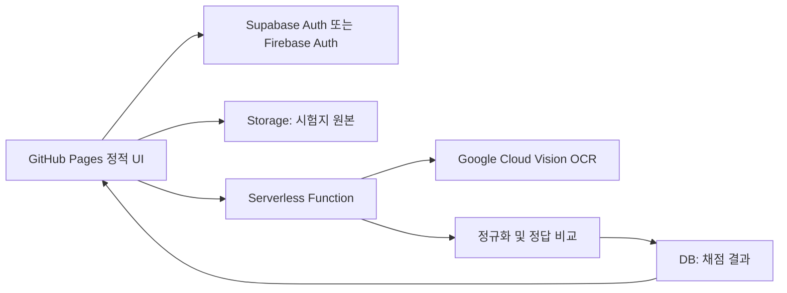

# 케미체크 UI 및 제품 기획

## 1. 제품 목표

카메라로 촬영한 한국 중고등학생 화학 단답형 시험지를 OCR로 읽고, 정답지와 비교하여 초벌 채점한다. 선생님은 OCR 신뢰도가 낮거나 정답 판정이 애매한 답만 검토하고, 시험지 원본과 결과를 학원별 / 클래스별 / 날짜별 / 학생별로 조회한다.

핵심 원칙은 `자동 판정 + 사람의 최종 확인`이다. 수기 답안은 글씨체, 화학식 아래첨자, 이온 전하, 반응식 계수 때문에 100% 자동 채점만으로 운영하기 어렵다.

## 2. 사용자 흐름

1. 선생님이 학원과 클래스, 학생, 사용할 정답지를 선택한다.
2. 모바일 카메라 또는 파일 선택으로 시험지 사진을 업로드한다.
3. 서버리스 함수가 Google Cloud Vision OCR을 호출하고, 문항 영역별 텍스트와 신뢰도를 저장한다.
4. 정규화 규칙으로 OCR 텍스트를 보정하고 정답 후보와 비교한다.
5. 낮은 신뢰도, 복수 정답 후보, 화학식처럼 민감한 답은 검토 대상으로 표시한다.
6. 선생님이 사진 원본과 OCR 결과를 나란히 보며 수정한 뒤 채점을 확정한다.
7. 확정 결과는 게시판형 기록과 학생별 이력에 반영한다.

## 3. 화면 구조

### 대시보드

- 오늘 채점 완료 수, 직접 검토 필요 수
- 최근 채점 관리
- `새 시험지 채점` 진입 버튼
- `검토 대기 보기` 바로가기

### 채점 관리 게시판

- 필터: 학원, 클래스, 기간, 학생 이름, 시험지 이름, 상태
- 목록: 채점일, 학생, 학원/클래스, 시험지, 점수, OCR 신뢰도, 상태
- 상세 화면: 시험지 원본, 문항별 OCR 텍스트, 정답, 판정, 선생님 수정 이력

### 시험지 관리

- 홈페이지 편집기에서 시험지 양식을 직접 생성
- 시험 카테고리, 양식명, 학교급, 과목을 입력해 빈 문서 생성
- 문항 수를 미리 제한하지 않고 편집 화면 하단의 `+ 문항 추가`와 문항별 삭제 버튼으로 구성
- 큰 편집 모달에서 카테고리와 과목을 선택하고 문항, 기준 답안, OCR 영역을 함께 수정
- 학생 답안이 작성될 OCR 인식 영역을 문항별 좌표로 지정
- 문항 질문, 기준 정답, 허용 표기 변형을 같은 화면에서 등록
- 생성된 시험지는 배경색 없이 인쇄하고, OCR 안내선은 학생 답 작성용 밑줄로 출력
- 학생이 촬영해 올린 사진을 원근 보정한 뒤 등록된 좌표로 잘라 OCR 처리
- 시험지 상단에 카테고리와 과목 식별값을 인쇄해 업로드 시 자동 분류
- 우측 이름 작성 칸도 별도 OCR 영역으로 관리해 학생 이름을 인식
- 채점 관리과 시험지 템플릿 관리는 별도 메뉴로 분리

### 카테고리와 담당 선생님

- 시험 카테고리는 클래스와 연결한다.
- 클래스별 주 담당, 보조 담당 선생님을 지정한다.
- 업로드된 시험지를 자동 분류한 뒤 해당 클래스 담당 선생님의 검토 목록으로 배정한다.

### 채점 기준 답안

- 시험지명, 학년, 과목 단원, 문항 수, 배점
- 문항별 허용 정답과 표기 변형 등록
- 예: `NaCl`, `염화 나트륨`, `염화나트륨`

### 운영 관리

- 학원 > 클래스 > 학생 계층
- 선생님 권한: 원장, 관리자, 채점 담당
- 학생별 시험 결과와 오답 이력

### 스마트폰 촬영 UI

- 스마트폰에서는 채점 관리을 표가 아닌 카드 목록으로 표시한다.
- 하단 고정 메뉴 중앙의 `채점` 버튼으로 한 손 조작이 가능하게 한다.
- 입력 방식은 `사진 첨부`와 `실시간 촬영`으로 분리한다.
- 사진 첨부 시 문서 모서리를 찾아 perspective transform으로 정면 이미지를 만든다.
- 실시간 촬영 시 카메라 위에 시험지 가이드 프레임을 표시한다.
- 네 모서리가 모두 검출되고, 흔들림과 기울기가 기준 범위 안에 들어온 경우에만 `인식 성공` 상태로 바꾼다.
- 인식 성공 후 자동 촬영하거나, 활성화된 촬영 버튼을 눌러 확정한다.

현재 프로토타입은 모바일 전용 UI, 후면 카메라 연결, 가이드 프레임, 인식 성공 상태를 포함한다. 실제 사각형 검출은 다음 구현 단계에서 OpenCV.js의 contour detection과 perspective transform을 연결한다. 저사양 스마트폰 대응이 필요하면 촬영 프레임 검출은 브라우저에서 낮은 해상도로 수행하고, 최종 원근 보정은 Edge Function에서 처리한다.

데스크톱 브라우저에서는 `실시간 촬영` 탭을 유지하되, 스마트폰 전용 기능이라는 안내만 표시한다. 사진 첨부와 자동 앵글 보정은 데스크톱에서도 사용할 수 있다.

### 학생 계정 흐름

1. 학생은 자신의 계정으로 로그인한다.
2. 시험 카테고리와 시험지를 선택하고 사진을 업로드한다.
3. 업로드 직후 상태는 `업로드 완료`이며 OCR 채점은 자동으로 시작하지 않는다.
4. 학생이 사진을 확인하고 `채점하기`를 눌러야 서버리스 OCR 작업이 생성된다.
5. 채점이 시작되기 전에는 이미지를 삭제하고 다시 올릴 수 있다.
6. 채점이 진행되거나 완료된 뒤에는 원본 이미지 교체를 금지한다.
7. 결과 화면은 시험지 원본 위에 빨간 연필 느낌의 정답·오답 표시를 겹쳐 보여준다.

원본 이미지를 직접 수정하지 않고, 문항별 표시 좌표와 판정 데이터를 별도로 저장하는 방식을 권장한다. 화면에서는 SVG 또는 Canvas 레이어로 `○`, `×`, 점수를 그리면 원본 보존과 수정 이력 관리가 쉽다.

## 4. 권장 서버리스 구성

Google OCR 인증 정보는 브라우저에 포함하면 안 된다. GitHub Pages에는 공개 가능한 클라이언트 설정만 두고, Vision API 호출은 Supabase Edge Function 또는 Firebase Cloud Function에서 처리한다.

초기 구현은 Supabase를 권장한다. Postgres 기반이라 학원 / 클래스 / 학생 / 시험지 / 문항 / 채점 결과처럼 관계가 많은 데이터 조회와 게시판 필터 구현이 자연스럽다. Firebase도 가능하지만 복합 필터와 집계 화면을 위해 별도 인덱스 설계가 더 많이 필요하다.

## 5. 최소 데이터 모델

| 테이블 | 주요 필드 |
| --- | --- |
| `academies` | `id`, `name` |
| `classes` | `id`, `academy_id`, `name`, `grade` |
| `students` | `id`, `academy_id`, `class_id`, `name` |
| `answer_sheets` | `id`, `academy_id`, `title`, `subject`, `unit` |
| `answer_items` | `id`, `answer_sheet_id`, `question_no`, `points`, `accepted_answers` |
| `grading_jobs` | `id`, `student_id`, `answer_sheet_id`, `image_path`, `status`, `score`, `ocr_confidence`, `created_at` |
| `grading_items` | `id`, `grading_job_id`, `question_no`, `ocr_text`, `normalized_text`, `is_correct`, `needs_review`, `reviewed_text` |

모든 테이블은 `academy_id`를 기준으로 Row Level Security를 적용한다. 시험지 원본 Storage도 학원별 경로로 분리한다.

## 6. 화학 단답형 판정 규칙

- 공백과 불필요한 구두점 제거
- 한글 답안의 띄어쓰기 변형 허용
- 영문 원소 기호 대소문자 보정 후보 제시
- 아래첨자 숫자와 일반 숫자 표기의 정규화
- 이온 전하 표기 위치 변형 후보 제시
- 반응식은 계수와 화살표를 분리하여 비교
- OCR 신뢰도가 임계치 미만이면 자동 확정하지 않고 검토 대상으로 이동

초기 버전은 답안 텍스트가 짧고 문항 위치가 고정된 자체 제작 시험지부터 시작하는 편이 좋다. 자유 형식 시험지 전체를 처음부터 지원하면 문항 영역 분리 난도가 크게 올라간다.

## 7. 구현 순서

1. Supabase 스키마, 인증, RLS 정책 구성
2. 학원 / 클래스 / 학생 / 정답지 CRUD
3. 시험지 원본 업로드와 채점 작업 생성
4. Edge Function에서 Vision OCR 호출
5. 문항 영역 분리와 화학 답안 정규화
6. OCR 검토 화면과 확정 처리
7. 게시판 필터, 학생별 이력, 간단 통계

## 8. 현재 프로토타입

`index.html`은 정적 화면 검토용이다. 데이터는 `app.js`의 예시 배열을 사용하며, 검색 / 학원 / 클래스 / 상태 필터와 새 시험지 채점 모달을 직접 확인할 수 있다.
